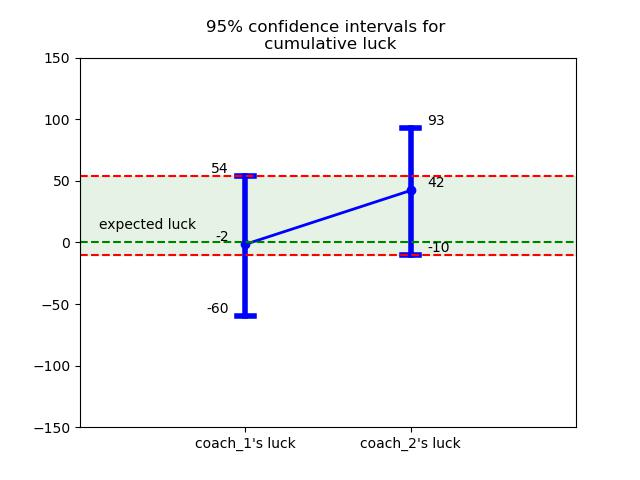

# Статистический метод оценки удачи в игре "Blood Bowl"
[English description below](#Blood-Bowl-Luck-Assessment-Method)
## Задача/цель работы
"Blood Bowl" как игра содержит в себе значительный элемент удачи, так что вопрос об измерении удачи встаёт весьма часто. В этой работе я пытаюсь разработать методику оценки удачи тренеров, опирающуюся на анализ результатов их бросков кубов.

## Стек
Python 3.11.7 (pandas, matplotlib, seaborn)

## Ход работы
Я ввожу и рассчитываю метрику "удача" для каждого броска кубов; математически доказываю, что при стремящемуся к бесконечности числу бросков кубов суммарная удача каждого тренера должна стремиться к 0.  

После этого я рассчитываю фактически получившиеся в матче значения суммарной удачи каждого тренера, с помощью бутстрапа определяю их доверительные интервалы и на основе этого делаю вывод о статистической значимости их различий.

## Результат
Результатом работы являются ответы на вопросы:
<ul>
    <li>насколько значимо отличается удача каждого тренера от ожидаемого значения (0),</li>
    <li>насколько значимо отличается удача каждого тренера друг от друга,</li>
</ul>
визуализированные в виде картинки. 

# Blood Bowl Luck Assessment Method
## Goals and Objectives
The game of "Blood Bowl" contains significant luck element, therefore it often raises question of assessment said luck. In this work I try to develop a method for estimating coaches' luck, based on their dice rolls.

## Stack
Python 3.11.7 (pandas, matplotlib, seaborn)

## Workflow
I introduce and count "luck" metric for every dice roll, and mathematically prove, that as the number of dice rolls approaches infinity, the total luck of each coach should approach 0.  

After that, I calculate the actual values ​​of the total luck of each coach in the match, use the bootstrap to determine their confidence intervals and, based on this, draw a conclusion about the statistical significance of their differences.

## Results
Now we are able to answer following questions:
<ul>
    <li>whether each coach's luck significantly differs from expected (0),</li>
    <li>whether coaches' luck significantly differ from each other,</li>
</ul>
visualized as a nice picture. 

